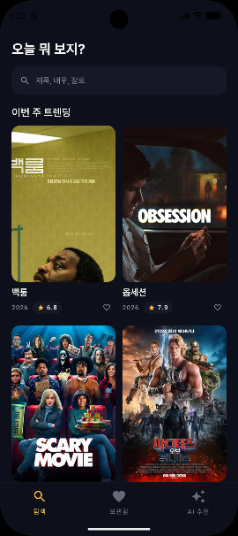
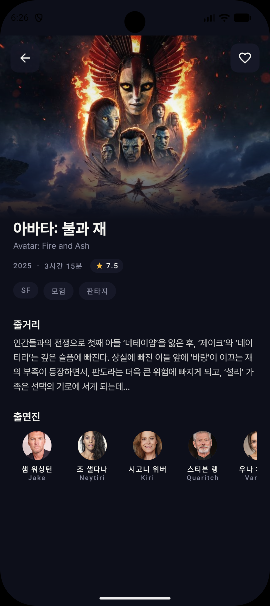
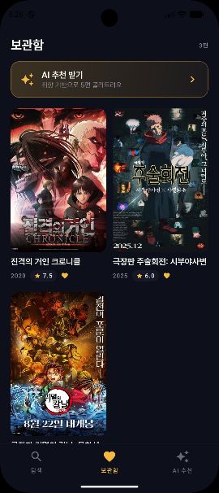
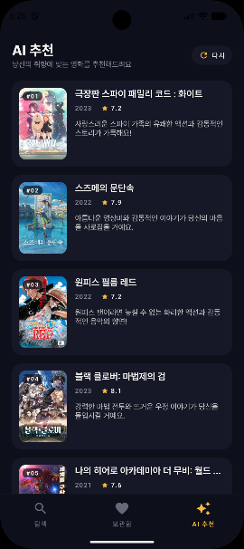

# MovieAI

> 취향을 학습해 다음에 볼 영화를 골라주는 Android 앱

TMDB로 영화를 검색·탐색하고, 보관함에 담은 작품을 바탕으로 **Gemini 2.5 Flash**가 다음에 볼 5편을 추천한다. 탐색·상세·보관함·AI 추천 4개 화면을 Jetpack Compose로 구현했다.

## 스크린샷

| 탐색 | 상세 | 보관함 | AI 추천 |
|:---:|:---:|:---:|:---:|
|  |  |  |  |

## 주요 기능

- **검색 & 트렌딩** — TMDB 검색과 주간 트렌딩을 Paging 3 무한 스크롤로
- **상세** — 개요·출연진·평점, 백드롭 패럴럭스
- **보관함** — 즐겨찾기를 Room에 로컬 저장
- **AI 추천** — 보관함을 분석해 Gemini가 추천 5편을 이유와 함께 제안, 결과는 오프라인 캐싱

## 설계

Clean Architecture(presentation · domain · data) + MVVM 단일 모듈. ViewModel은 UseCase에만 의존하고, 화면 상태는 모두 `StateFlow`로 노출한다. 레이어 구조와 데이터 흐름(검색 / AI 추천 시퀀스)은 [`docs/ARCHITECTURE.md`](docs/ARCHITECTURE.md)에 다이어그램으로 정리했다.

**구현하며 신경 쓴 부분**

- Gemini `thinkingBudget=0` + 직렬화 기본값(`encodeDefaults`) 처리로 추천 응답을 **~15s → ~3-5s**로 단축
- 추천 결과를 Room에 캐싱해 앱 재실행에도 유지하고 Flow로 관찰
- 검색 400ms 디바운스(입력 coalescing) + `flatMapLatest`로 스테일 쿼리 자동 취소

## 기술 스택

| 분류 | 기술 |
|---|---|
| 언어 | Kotlin |
| UI | Jetpack Compose · Material 3 · Coil |
| DI | Hilt |
| 비동기 | Coroutines · Flow |
| 네트워크 | Retrofit · OkHttp · kotlinx.serialization |
| 로컬·페이징 | Room · Paging 3 |
| 내비게이션 | Navigation Compose |

`compileSdk 36 · minSdk 26 · JDK 17`
