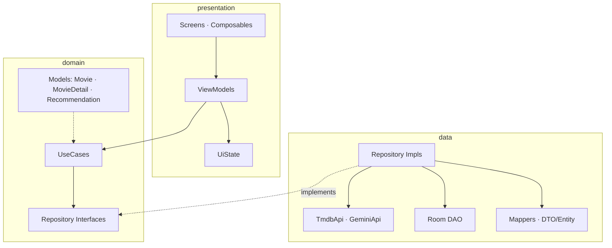
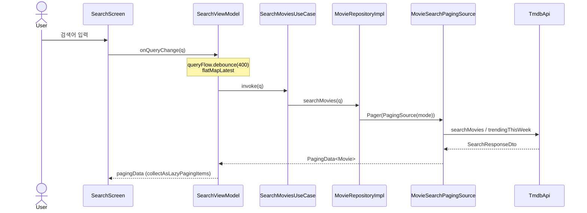
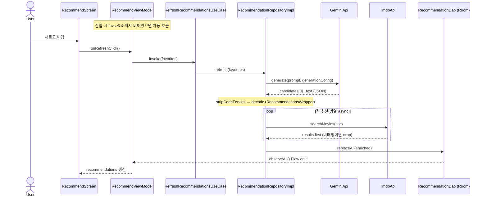

# MovieAI — Architecture

Clean Architecture를 단일 Gradle 모듈 안에서 패키지로 분리해 구현했다. 의존성 방향은 항상 안쪽(domain)을 향한다: **presentation → domain ← data**.

---

## 1. 레이어 구조



**레이어 규칙**

- `domain/**` — 순수 Kotlin + Coroutines/Flow만. (단, `PagingData` 예외는 §5 참고.) Android / Retrofit / Room / Compose 의존 금지.
- `data/**` — `domain`의 repository 인터페이스를 구현. DTO/Entity ↔ Domain Model을 매퍼로 변환해 **도메인 타입만** 위로 반환.
- `presentation/**` — ViewModel은 UseCase만 주입받음(Repository 직접 참조 금지). 화면은 `StateFlow<XxxUiState>`를 `collectAsStateWithLifecycle()`로 구독.

---

## 2. 화면 & 데이터 흐름 개요

| 화면 | ViewModel | 주요 UseCase | 백엔드 |
|---|---|---|---|
| 탐색 (Search) | `SearchViewModel` | `SearchMoviesUseCase`, `ObserveFavoritesUseCase`, `ToggleFavoriteUseCase` | TMDB (Paging) |
| 상세 (Detail) | `DetailViewModel` | `GetMovieDetailUseCase` | TMDB |
| 보관함 (Favorites) | `FavoritesViewModel` | `ObserveFavoritesUseCase`, `ToggleFavoriteUseCase` | Room |
| AI 추천 (Recommend) | `RecommendViewModel` | `ObserveFavoritesUseCase`, `ObserveRecommendationsUseCase`, `RefreshRecommendationsUseCase` | Gemini + TMDB + Room |

---

## 3. 시퀀스 — 검색 흐름

빈 쿼리는 `Trending` 모드로, 입력이 있으면 `Search` 모드로 같은 PagingSource를 통해 흐른다. 입력은 400ms 디바운스 후 `flatMapLatest`로 이전 쿼리를 취소한다.



---

## 4. 시퀀스 — AI 추천 흐름

추천은 **Room에 캐시**된다. 화면은 캐시를 Flow로 구독하고, 새로고침(또는 진입 시 자동 1회)이 Gemini 호출 → JSON 파싱 → TMDB 보강 → `replaceAll`로 캐시 교체를 트리거한다. 결과는 다시 Flow를 통해 화면에 반영된다.



**Gemini 요청 설정 (`GenerationConfig`)** — 응답 지연을 줄이는 핵심:

- `thinkingConfig.thinkingBudget = 0` — 2.5-flash의 기본 chain-of-thought 비활성화 (~10-30s → ~3-5s).
- `responseMimeType = "application/json"`, `maxOutputTokens = 1024`.
- 이 값들은 전부 **기본값**이라 `Json { encodeDefaults = true }`가 없으면 직렬화에서 누락돼 thinking이 다시 켜진다. 실제로 한 번 회귀했던 지점이라 `NetworkModule.provideJson()`에서 보장.
- 응답이 가끔 ` ```json ... ``` ` 펜스로 감싸져 오는 2.5-flash 특성은 `stripCodeFences`로 방어.

---

## 5. 내비게이션

`Scaffold` + `BottomNav`. 상위 3개 탭(탐색/보관함/AI 추천)은 바텀 내비로 전환되며 상태를 보존(`saveState`/`restoreState`)한다. 상세는 스택에 push된다.

```mermaid
flowchart LR
  Search[search<br/>시작 화면] -->|movie 탭| Detail[detail/&#123;id&#125;]
  Favorites[favorites] -->|movie 탭| Detail
  Favorites -->|AI 추천 CTA| Recommend[recommend]
  Recommend -->|movie 탭| Detail
  Search <-->|BottomNav| Favorites
  Favorites <-->|BottomNav| Recommend
```



- 상위 라우트: `search`, `favorites`, `recommend` (`Screen.topLevelRoutes`).
- 화면 전환 애니메이션은 비활성(`EnterTransition.None`) — 탭 전환을 즉각적으로.

---

## 6. `PagingData` 레이어 예외

`MovieRepository.searchMovies()`는 `Flow<PagingData<Movie>>`를 반환한다. `PagingData`는 `androidx.paging`(엄밀히는 Android 의존성)에 속하므로 **순수 domain 규칙을 한 군데 위반**한다.

이 예외를 의도적으로 수용한 이유: Paging 3는 본질적으로 presentation과 강하게 결합되어 있고, `PagingData`를 도메인 전용 타입으로 다시 감싸면 실익 없는 보일러플레이트만 늘어난다. 나머지 레이어 규칙은 엄격히 지킨다.

---

## 7. 스레딩 규칙

- Repository는 `withContext(Dispatchers.IO)`에서 네트워크/DB 작업 수행.
- ViewModel은 `viewModelScope`만 사용.
- `runBlocking` · `GlobalScope` 사용 금지.
- `StateFlow`는 `stateIn(viewModelScope, SharingStarted.WhileSubscribed(5_000), …)`로 노출.

---

## 8. 디자인 시스템

다크 테마(Midnight Noir + 앰버 골드) 토큰은 `presentation/theme/`에 모여 있다.

- **색상** — `MovieAiColors`에 정의하고 `darkColorScheme`으로 매핑. 포스터 배경은 `MovieAiGradients.forMovieId(id)`가 8색 그라데이션 풀에서 `id` 기반으로 하나를 골라, 같은 영화엔 항상 같은 색을 반환.
- **타이포그래피** — Pretendard(한글 본문·제목), Inter(라틴), JetBrains Mono(메타데이터)를 `Typography` 슬롯에 매핑. Inter·JetBrains Mono는 Google Fonts Provider로 런타임 로드.
- **모양** — `MovieAiShapes`에 8·10·14·16dp와 pill(999dp) 코너 반경.
